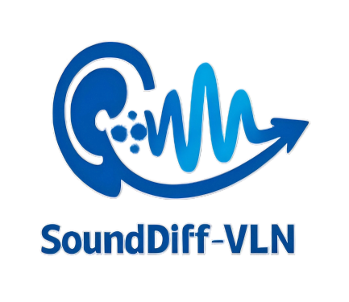

# SoundDiff-VLN
<p align="center">
  
</p>
A Task-Conditioned Diffusion Acoustic Prior Framework for Instruction-Level Audio-Visual-Language Navigation

<a id="top"></a>

## Table of Contents

-  [Installation](#Installation)
-  [Data Preparation](#data-preparation)
-  [Model Zoo](#Model)
-  [Training](#Training)
-  [Evaluation](#Evaluation)
-  [Citing](#citing)

<p align="right">
  <a href="#top">
    
  </a>
</p>
>


## Installation
Create the required environment through the following steps:


1.`git clone https://github.com/lyk761167/SoundDiff-VLN && cd SoundDiff-VLN`

2.Create a virtual env with python=3.9, this will be used throughout:

`conda create -n sounddiff python=3.9 cmake=3.14.0 -y && conda activate sounddiff`

3.Install Python dependencie

`pip install -r requirements.txt`

4.Install [habitat-sim v0.1.7](https://github.com/facebookresearch/habitat-sim/tree/v0.1.7) (Please note: to use Soundspace 2.0 for rendering, you must also download version V0.2.2 of Habitat-Sim and Habitat-Lab for audio rendering.)

Check further instructions from [here](https://github.com/facebookresearch/habitat-sim/blob/v0.1.7/BUILD_FROM_SOURCE.md) — `--headless --with-cuda`

5.Install habitat-lab (modified version of habitat-lab v0.1.7).

```bash
git clone https://github.com/facebookresearch/habitat-lab.git
cd habitat-lab
git checkout v0.1.7
pip install -e .
```
<p align="right">
  <a href="#top">
    
  </a>
</p>

##  Data Preparation
1. Scene Dataset

- Download the MP3D scenes from the [official project page](https://niessner.github.io/Matterport/), and place them under `data/scene_datasets/mp3d/`.

2. R2R-CE Episodes
   Download the VLN-CE episodes and extract them into the data directory:

- [r2r](https://drive.google.com/file/d/1fo8F4NKgZDH-bPSdVU3cONAkt5EW-tyr/view) (Rename R2R-CE)
  [Here](https://github.com/facebookresearch/sound-spaces/blob/main/SoundSpaces2.md) is the rendering tutorial for Soundspace2.0 on r2r.
  To enable audio propagation configuration in Habitat-Sim (SoundSpaces 2.0/Audio API), set the following:
    Source position (world coordinates)
    Receiver position and orientation (corresponding to the agent's pose)
  Sampling rate, maximum reflection order/ray tracing parameters, etc.At each step, directly query the rendered binaural waveform or RIR, and then feed it into the model.
  
3. Soundspace dataset
  
  Follow instructions on the [dataset](https://github.com/facebookresearch/sound-spaces/tree/main/soundspaces)  page to download the rendered audio data and datasets and put them under project/data/ folder.

  
Your final folder structure should look like this:
  ```text
data/
├── datasets/
│   ├── audionav/
│   └── semantic_audionav/
├── scene_datasets/
│   └── mp3d/
│       ├── 17DRP5sb8fy/
│       ├── 1LXtFkjw3qL/
│       └── ..../
├── scene_observations/
│   └── mp3d/
│       ├── 17DRP5sb8fy.pkl/
│       ├── 1LXtFkjw3qL.pkl/
│       └── ..../
├── hf_models/
│   ├── Qwen2-Audio-7B-audio_tower/
│   │   ├── model.safetensors/
│   │   └── config.json/
│   └── Qwen2-Audio-7B/
│       ├── tokenizer.json/
│       ├── model-00001-of-00005.safetensors/
│       └── ..../
├── metadata/
│   └── mp3d/
├── r2r-audio/
│   ├── train/
│   │   ├── train.json/
│   │   └── ..../
│   ├── val_seen/
│   │   ├── val_seen.json/
│   │   └── ..../
│   └── val_unseen/
│       ├── val_unseen.json/
│       └── ..../
├── r2r/
├── binaural_rirs/
├── pretrained_weights/
├── sounds/
└── models
    ├──output/
    └── mp3d/
```
<p align="right">
  <a href="#top">
    
  </a>
</p>


##  Model
1.We utilize the Qwen2-Audio-7B model as our audio pre-trained large model, which can be downloaded from [here](https://huggingface.co/Qwen/Qwen2-Audio-7B)

2.We have separately provided model weights for the two datasets and the prior model:
<table>
  <thead>
    <tr>
      <th>Model</th>
      <th>Data</th>
      <th>Name</th>
    </tr>
  </thead>
  <tbody>
    <tr>
      <td rowspan="3">SoundDiff-VLN</td>
      <td>Soundspace</td>
      <td><a href="https://huggingface.co/lykhaixing/SoundDiff-VLN">SoundDiff-soundspace</a></td>
    </tr>
    <tr>
      <td>r2r_audio</td>
      <td><a href="https://huggingface.co/lykhaixing/SoundDiff-VLN">SoundDiff-r2r</a></td>
    </tr>
    <tr>
      <td>prior</td>
      <td><a href="https://huggingface.co/lykhaixing/SoundDiff-VLNs">SoundDiff-priora</a></td>
    </tr>
  </tbody>
</table>

<p align="right">
  <a href="#top">
    
  </a>
</p>


##  Training
1.To train on the SoundSpace dataset(Please first pre-train the diffusion model)

`python ss_baselines/savi/run.py --exp-config ss_baselines/savi/config/semantic_audionav/Sounddiff.yaml --model-dir data/models/Sounddiff `

2.To train on the R2R-audio dataset

`python ss_baselines/savi/run1.py --exp-config ss_baselines/savi/config/semantic_audionav/r2r-audio.yaml --model-dir data/models/r2r_audio_sounddiff   `
<p align="right">
  <a href="#top">
    
  </a>
</p>


## Evaluation
1.To evaluate on the SoundSpace dataset

`python ss_baselines/av_nav/run.py --run-type eval --exp-config ss_baselines/savi/config/semantic_audionav/Sounddiff.yaml --model-dir data/models/Sounddiff EVAL_CKPT_PATH_DIR data/models/Sounddiff/ckpt.XXX.pth`

2.To evaluate on the SoundSpace dataset

`python ss_baselines/savi/run1.py --exp-config ss_baselines/savi/config/semantic_audionav/r2r-audio.yaml --model-dir data/models/r2r_audio_sounddiff  EVAL_CKPT_PATH_DIR data/models/r2r_audio_sounddiff/ckpt.XXX.pth  `

<p align="right">
  <a href="#top">
    
  </a>
</p>


##   Citing
If you find SoundDiff-VLN is useful in your research or applications, please consider giving us a star 🌟 and citing our paper.(The citation information will be available after publication.)
##   Acknowledgement
Our work is primarily based on the following codebases:[Qwen2-Audio-7B](https://huggingface.co/Qwen/Qwen2-Audio-7B), [Soundspace](https://github.com/facebookresearch/sound-spaces/tree/main/soundspaces), [AVLEN](https://github.com/merlresearch/avlen/tree/main?tab=readme-ov-file). We are sincerely grateful for their work.
